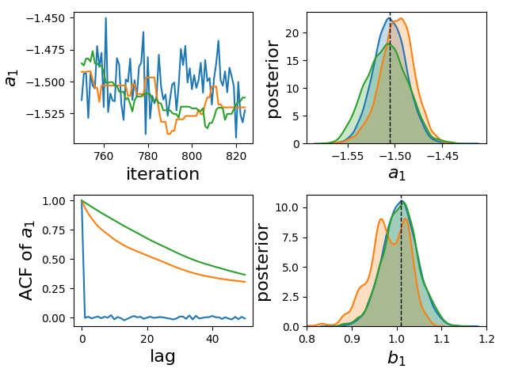
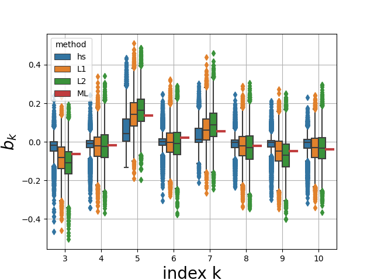

# Practical Bayesian System Identification using Hamiltonian Monte Carlo

Companion code to the paper

Title: Practical Bayesian System Identification using Hamiltonian Monte Carlo

Authors: Johannes N. Hendriks, Adrian G. Wills, Brett Ninness and Johan Dahlin

## Paper Abstract

This paper considers Bayesian parameter estimation of dynamic systems using a Markov Chain Monte Carlo (MCMC) approach. 
The Metroplis–Hastings (MH) algorithm is employed, and the main contribution of the paper is to examine and illustrate 
the efficacy of a particular proposal density based on energy preserving Hamiltonian dynamics, which results in what is 
known in the statistics literature as “Hamiltonian Monte–Carlo” (HMC). The very significant utility of this approach is that, 
as will be illustrated, it greatly reduces (almost to the point of elimination) the typically very high correlation in the 
Metropolis– Hastings chain which has been observed by several authors to restrict the application of the MH approach 
to only very low dimension model structures. The paper illustrates how the HMC approach may be applied to both 
significant dimension linear and nonlinear model structures, even when the system order is unknown, and using both simulated 
and real data.

## Overview of code examples in this repository

This git repository contains code to run the examples included in the paper as well as several additional examples. 
Examples included in the paper:
- Matlab code for the pedagogical illustration of sampling from a donut shaped target density (paper section 4.2)
- Estimation of an ARX model of known order from simulated data, comparing HMC with other MCMC and ML approaches (paper section 7.1)
- Estimation of an ARX model of unknown order from simulated data, comparing HMC with different priors to ML (paper section 7.2)
- Estimation of an OE model of unknown order from simulated data using HMC and comparing to ML approach (paper section 7.3)
- Estimation of an ARX model of unknown order from simulated data with significant outliers and comparison to an ML approach (paper section 7.4)
- Estimation of a non-linear inverted pendulum model from real data (paper section 7.5)

Additoinal examples not included in the paper:

### Python code requirements
- Python 3.7 or greater
- Pystan 2.21
- numpy
- matplotlib
- seaborn
- pandas
- pickle
- scipy

### Matlab code requirements
A recent version of matlab with the system identification toolbox


## Sampling from a donut shaped target density
Matlab code to sample from this distribution using HMC is given in
```
matlab/HMC_donut_example.m
```

Plots of the results shown below

k=1 | k=2 | k=3 | k=1,...,10
:-----------------:|:-----------------:|:-----------------:|:-----------------:
 | ||


Matlab code to sample from this distribution using MH with a random walk proposal is given in
```
matlab/MH_donut_example.m
```

Plots of the results shown below

k=1 | k=2 | k=3 | k=1,...,10
:-----------------:|:-----------------:|:-----------------:|:-----------------:
 | ||


Plots from this code

## ARX example part 1
Estimation of an ARX model of known order from simulated data, comparing HMC with other MCMC and ML approaches (paper section 7.1)

ARX model structure


The following parameters are sampled/estimated


Running the following code performs the HMC sampling and generates corresponding plots using saved data

```
python example1_arx_part1.py
```

Alternatively new data and ML results can be generated by running the matlab code
```
matlab/example1_arx_part1.m
```

The following diagnostic of the different sampling methods performance is given showing
the trace of the a_1 parameter, the autocorrelation of the samples for this parameter and the 
resulting distributions

 


## ARX example part 2
Estimation of an ARX model of unknown order from simulated data, comparing HMC with different priors to ML 
(paper section 7.2)

The same model structure and parameters to be estimated as in the last example

Running the following code performs the HMC sampling and generates corresponding plots using saved data

```
python example1_arx_part2.py
```

Alternatively new data and ML results can be generated by running the matlab code
```
matlab/example1_arx_part2.m
```

The impact of the different priors on the estimated parameters is compared and we can see that the horseshoe 
prior has the greatest impact on setting unnecesary parameters to zero

Output regressor coefficients | Input regressor coefficients
:-----------------------------:|:-------------------------------------:
 | 


The HMC with horseshoe prior estimated systems frequency response is compared to the true system and the ML estimate
given using Matlab's arx function

 


## Output error example 
Estimation of an output error model of unknown order from simulated data and comparison to ML approach with regularisation 
(paper section 7.3)

Output model structure


The following parameters are sampled/estimated


Running the following code performs the HMC sampling and generates corresponding plots using saved data

```
python example2_oe.py
```

Alternatively new data and ML results can be generated by running the matlab code
```
matlab/example2_oe.m
```

The following diagnostic of the different sampling methods performance is given showing
the trace of the a_1 parameter, the autocorrelation of the samples for this parameter and the
resulting distributions


## Measurement outlier example
Estimation of an ARX model of unknown order from simulated data with significant outliers and comparison to an ML approach
with regularisation (paper section 7.4)

The same model structure as in ARX example 1 is used


Running the following code performs the HMC sampling and generates corresponding plots using saved data

```
python example3_outliers.py
```

Alternatively new data and ML results can be generated by running the matlab code
```
matlab/example3_outlier.m
```

The estimated nyquist plot for the hmc samples and the ML approach are shown below


## Nonlinear inverted pendulum
Estimation of the parameters of a non-linear rotary inverted pendulum from real data collected using
the QUBE-Servo 2 of QUANSAR. The continuous time dynamics of the system can be modelled by

\begin{bmatrix}\ddot{\theta}&space;\\&space;\ddot{\alpha}\end{bmatrix}&space;&plus;&space;\nu(\dot{\theta},\dot{\alpha}){\begin{bmatrix}\dot{\theta}&space;\\&space;\dot{\alpha}\end{bmatrix}&space;=&space;\begin{bmatrix}\tau&space;-&space;D_r\dot{\theta}&space;\\&space;-\frac{1}{2}m_pL_pg\sin(\alpha)-D_p\dot{\alpha}\end{bmatrix},)

where


